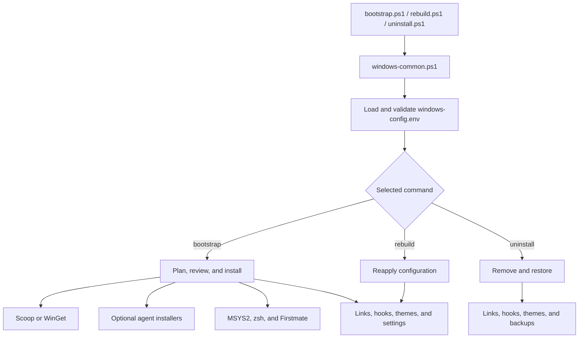

# Kun Chen's Agentic Engineering Setup for Windows

A reproducible, terminal-first Windows development environment inspired by Kun
Chen's dotfiles and agentic engineering workflow.

Go from a fresh Windows machine to a complete setup for building with agents:
a beautiful terminal, keyboard-first shells, Neovim, terminal multiplexing,
shared agent memory, reusable skills, isolated worktrees, and automated quality
workflows.

Run one bootstrap command, choose your tools, and let the repository configure
the rest. The setup uses one native PowerShell engine. Git Bash and MSYS2 zsh
remain supported runtime shells, but setup itself is PowerShell-only.

## Watch the Workflow

These videos explain the ideas and tools this repository brings to Windows:

- [Full development environment setup](https://www.youtube.com/watch?v=5N-okeDdIuI&t=2082s) - terminal, shell, Neovim, themes, and agent configuration
- [Agentic engineering workflow](https://www.youtube.com/watch?v=iQyg-KypKAA&t=1302s) - skills, parallel agents, worktrees, validation, and Firstmate
- [Kun Chen's original dotfiles](https://github.com/kunchenguid/dotfiles) - the Mac-based source of the workflow

## What You Get

- **The ship:** Windows Terminal, themes, Starship, optional Oh My Posh, PowerShell, Git Bash, MSYS2 zsh, psmux, and Herdr.
- **The editor:** Neovim with a curated navigation, Git, UI, and color theme setup.
- **The crew:** Shared agent instructions plus configuration for Claude, Codex, opencode, and Pi.
- **The workflow:** GitHub AXI, Chrome DevTools AXI, Lavish AXI, no-mistakes, gnhf, Treehouse, and optional Firstmate.
- **The foundation:** Interactive configuration, reproducible package and link management, shell hooks, backups, rebuilds, and opt-in Windows settings.

The result is a keyboard-driven environment designed for staying in flow while
working with one agent or coordinating a whole crew of agents in parallel.

## Kun's Workflow on Windows

This is a native Windows implementation of the same ideas rather than a Bash
copy of the setup logic:

| Kun Chen's workflow | Windows implementation |
| --- | --- |
| nix-darwin and home-manager | Native PowerShell engine, package manager, and link manifest |
| Declarative machine setup | Native PowerShell bootstrap, rebuild, and uninstall commands |
| User-level application configuration | `home/` plus a managed link manifest |
| Terminal-first development | Windows Terminal, Herdr, and psmux |
| zsh shell experience | MSYS2 zsh with zsh plugins |
| Keyboard-first editor | Neovim configuration with lazy.nvim |
| Shared agent memory | `home/AGENTS.md` linked to Claude, Codex, and opencode |
| Agent skills and tool ergonomics | GitHub AXI, Chrome DevTools AXI, and Lavish AXI |
| Automated quality workflow | no-mistakes |
| Long-running agent work | gnhf |
| Parallel isolated work | Treehouse |
| Agent orchestration | Optional Firstmate |

## Quick Start

### Requirements

- Windows 10 or Windows 11.
- Windows PowerShell 5.1 or PowerShell 7. Bootstrap can install PowerShell 7 through WinGet when needed.
- Git for Windows, or the repository downloaded as a ZIP archive.
- Network access for package downloads, installers, and Neovim's first plugin sync.
- WinGet and Microsoft App Installer when PowerShell 7 must be installed automatically.

The default junction and hard-link mode normally works without elevation when
the repository and Windows profile are on the same volume. Symbolic-link mode
requires Windows Developer Mode or administrator permission. WinGet packages and
third-party installers may still request elevation.

### Install

With Git for Windows:

```powershell
git clone https://github.com/yogeshsuryag/dotfiles.git
Set-Location dotfiles
.\bootstrap.ps1
```

Without Git, download and extract the repository ZIP, open PowerShell in the
extracted directory, and run:

```powershell
.\bootstrap.ps1
```

If script execution is restricted, use a process-scoped policy override:

```powershell
powershell.exe -NoProfile -ExecutionPolicy Bypass -File .\bootstrap.ps1
```

The first run opens a keyboard-driven setup wizard and then a package review.
The wizard saves choices to the ignored local `windows-config.env` file. Use
`Space` to toggle options, `Enter` to edit or select, `Tab` or the arrow keys to
navigate, and `Escape` to cancel. During page navigation and review, `q` also
cancels; while editing a value, `q` is entered as text.

Review the optional installers before accepting the package plan. Bootstrap can
install tools from Scoop, WinGet, npm, npx, GitHub, and configurable PowerShell
installer URLs.

> **Before you run it:** Bootstrap can download and execute third-party package
> managers, npm and npx packages, GitHub content, and PowerShell installers.
> Review `windows-config.example.env` and disable optional components you do not
> need or trust.

## How to Use This Repository

The normal workflow is simple:

```text
  configure      install once       edit home/       reapply       use
      |               |                 |              |           |
      v               v                 v              v           v
 windows-config.env  bootstrap.ps1     your changes    rebuild.ps1  shells/tools
```

### First Setup

Run `bootstrap.ps1` once. It creates the local configuration, presents the
package plan, installs approved tools, and applies the repository configuration.

```powershell
.\bootstrap.ps1
```

### Change Dotfiles

Edit tracked files under `home/`, then reapply the links and integrations:

```powershell
.\rebuild.ps1
```

### Change Packages or Installers

Edit the local `windows-config.env` file or run the wizard again, then use
`bootstrap.ps1` so the package and installer plan runs again:

```powershell
.\bootstrap.ps1 --configure
.\bootstrap.ps1
```

`rebuild.ps1` reapplies configuration but does not install newly selected
packages, skills, agent CLIs, Herdr, no-mistakes, gnhf, or Treehouse.

### Inspect Before Applying

Use `--check` to validate configuration and inspect the selected package plan:

```powershell
.\bootstrap.ps1 --check
```

For a separate local configuration file, set `DOTFILES_CONFIG_FILE` only for
the current PowerShell process:

```powershell
$env:DOTFILES_CONFIG_FILE = "$PWD\windows-config.work.env"
.\bootstrap.ps1 --check
```

### Remove the Integration

Review the target configuration, then run the interactive uninstaller:

```powershell
.\uninstall.ps1 --check
.\uninstall.ps1
```

## Daily Workflow

Restart Git Bash after bootstrap so the managed shell hook loads. Restart
PowerShell after bootstrap so the profile, Starship, and generated commands are
available. When zsh is enabled, launch it from the MSYS2 shell or the managed
`zsh (MSYS2)` Windows Terminal profile.

| Environment | Use |
| --- | --- |
| PowerShell | Run setup commands, native Windows tools, and the generated Firstmate bridge |
| Git Bash | Use the managed Bash configuration, editor variables, aliases, and agent commands |
| MSYS2 zsh | Use zsh, autocomplete plugins, fzf bindings, and the full Windows `PATH` |
| Windows Terminal | Open the themed PowerShell or managed `zsh (MSYS2)` profile |
| Neovim | Edit code and repository configuration from `home/.config/nvim` |

The `cc` and `co` aliases in Git Bash and MSYS2 zsh intentionally launch Claude
and Codex with high-agency permissions. Review them before using them.

## The Agentic Workflow

The setup is designed around a simple loop:

1. Plan clearly with your agent and use Lavish when a visual planning artifact helps.
2. Run agents in parallel with psmux or Herdr.
3. Give each task an isolated Treehouse worktree.
4. Let no-mistakes validate changes and prepare a clean pull request.
5. Use gnhf for long-running, verifiable improvement loops.
6. Use Firstmate when you want one agent to coordinate the rest of the crew.

The shared `home/AGENTS.md` file gives supported agents a consistent baseline of
preferences and engineering practices. Project-specific instructions can still
live in each project repository.

## Technical Details

### Setup Architecture

The setup implementation is composed from the PowerShell modules in `scripts/`.
The entry points share the same configuration and execution engine:

- `bootstrap.ps1` installs selected packages and optional tools, then applies shells, links, hooks, themes, and settings.
- `rebuild.ps1` reapplies repository configuration, shell integration, themes, and selected settings.
- `uninstall.ps1` removes repository-managed integration and restores available backups.

There is no parallel Bash installer. Git Bash and MSYS2 zsh are supported shells
that consume the configuration applied by PowerShell.

### Execution Flow



`bootstrap.ps1` runs the complete flow. `rebuild.ps1` starts at the integration
steps and reapplies repository configuration. `uninstall.ps1` runs the cleanup
and restoration path.

### Scripts

| Script | Responsibility | Used by |
| --- | --- | --- |
| [`bootstrap.ps1`](bootstrap.ps1) | Initial installation and application of the environment | Fresh setup or package changes |
| [`rebuild.ps1`](rebuild.ps1) | Reapply links, shells, themes, and settings | Daily configuration changes |
| [`uninstall.ps1`](uninstall.ps1) | Remove managed integration and restore backups | Cleanup |
| [`scripts/windows-common.ps1`](scripts/windows-common.ps1) | Loads the shared PowerShell modules in order | All entry points |
| [`scripts/windows-config.ps1`](scripts/windows-config.ps1) | Loads defaults, parses environment files, normalizes paths, and validates values | All entry points |
| [`scripts/windows-config-tui.ps1`](scripts/windows-config-tui.ps1) | Provides the keyboard-driven configuration wizard | `--configure` modes |
| [`scripts/windows-plan.ps1`](scripts/windows-plan.ps1) | Detects tools, creates the package plan, reviews actions, and dispatches installation | Bootstrap |
| [`scripts/windows-prereq.ps1`](scripts/windows-prereq.ps1) | Ensures PowerShell 7 is available when required | Bootstrap and rebuild |
| [`scripts/windows-scoop.ps1`](scripts/windows-scoop.ps1) | Installs Scoop, buckets, and Scoop packages | Scoop mode |
| [`scripts/windows-winget.ps1`](scripts/windows-winget.ps1) | Installs WinGet packages and portable tool archives | WinGet mode |
| [`scripts/windows-installers.ps1`](scripts/windows-installers.ps1) | Installs skills, agent CLIs, Herdr, no-mistakes, gnhf, and Treehouse | Bootstrap |
| [`scripts/windows-msys2.ps1`](scripts/windows-msys2.ps1) | Installs MSYS2, zsh, plugins, and the zsh startup block | Bootstrap and rebuild |
| [`scripts/windows-firstmate.ps1`](scripts/windows-firstmate.ps1) | Clones Firstmate and creates the shell launchers | Bootstrap and rebuild |
| [`scripts/windows-apply.ps1`](scripts/windows-apply.ps1) | Builds resolved paths and dispatches links and Windows settings | Bootstrap, rebuild, uninstall |
| [`scripts/windows-link-manifest.ps1`](scripts/windows-link-manifest.ps1) | Defines repository sources and Windows destinations | Link application and removal |
| [`scripts/windows-links.ps1`](scripts/windows-links.ps1) | Creates managed links and preserves eligible existing targets | Bootstrap and rebuild |
| [`scripts/windows-hooks.ps1`](scripts/windows-hooks.ps1) | Adds or removes the managed Git Bash startup block | Bootstrap, rebuild, uninstall |
| [`scripts/windows-theme.ps1`](scripts/windows-theme.ps1) | Renders or removes the Herdr configuration | Bootstrap, rebuild, uninstall |
| [`scripts/windows-terminal.ps1`](scripts/windows-terminal.ps1) | Merges themes and profiles into Windows Terminal and restores backups | Bootstrap, rebuild, uninstall |
| [`scripts/windows-settings.ps1`](scripts/windows-settings.ps1) | Applies selected opt-in registry settings | Bootstrap and rebuild |
| [`scripts/windows-uninstall.ps1`](scripts/windows-uninstall.ps1) | Removes managed links and restores matching link backups | Uninstall |
| [`scripts/windows-tools.ps1`](scripts/windows-tools.ps1) | Shared command, PATH, path-conversion, and managed-block helpers | All modules |

### Repository Layout

| Path | Purpose |
| --- | --- |
| [`bootstrap.ps1`](bootstrap.ps1) | Initial setup entry point |
| [`rebuild.ps1`](rebuild.ps1) | Reapply configuration entry point |
| [`uninstall.ps1`](uninstall.ps1) | Cleanup and restoration entry point |
| [`scripts/`](scripts/) | Native PowerShell setup engine and modules |
| [`home/`](home/) | Tracked shell, terminal, editor, and agent configuration |
| [`tests/`](tests/) | PowerShell, Git Bash, and Pi Calm validation suites |
| [`windows-config.example.env`](windows-config.example.env) | Complete configuration template |
| [`AGENTS.md`](AGENTS.md) | Project-wide instructions for contributors and agents |

### Command Lifecycle

| Command | Scope |
| --- | --- |
| `bootstrap.ps1` | Initial packages, optional installers, shells, links, hooks, themes, and settings |
| `bootstrap.ps1 --configure` | Reopen the setup wizard and apply its configuration |
| `bootstrap.ps1 --check` | Validate configuration and inspect the selected package plan without installing |
| `rebuild.ps1` | Reapply links, hooks, zsh, Firstmate launchers, Herdr config, Windows Terminal settings, and opt-in registry settings |
| `rebuild.ps1 --configure` | Reopen the setup wizard, then reapply configuration |
| `uninstall.ps1` | Remove managed links and integrations and restore matching backups |
| `uninstall.ps1 --check` | Validate uninstall configuration without changing anything |

Changing package or installer selections requires `bootstrap.ps1`. `rebuild.ps1`
does not install newly selected packages, skills, agent CLIs, Herdr, no-mistakes,
gnhf, or Treehouse.

### Default Profile

The tracked `windows-config.example.env` enables the following by default:

- Scoop and the core command-line tools.
- psmux and the dedicated psmux Scoop bucket.
- GitHub AXI, Chrome DevTools AXI, and Lavish AXI.
- no-mistakes, gnhf, and Treehouse.
- MSYS2 zsh and its autocomplete plugins.
- Herdr's Windows installer.
- Git Bash integration and repository backups.

The following are opt-in or disabled by default:

- Firstmate.
- Claude, Codex, Pi, and opencode CLI installation.
- Oh My Posh.
- Windows registry settings.

The package review still lets you skip or change individual package actions.

### Package Managers

Scoop is the default package manager. It installs applications into the user's
Scoop layout and exposes command shims on `PATH`. psmux is available through
Scoop mode because its dedicated bucket is Scoop-specific.

WinGet is an alternative. In WinGet mode, Git, Node.js, Neovim, and Starship
use portable downloads, while the remaining package IDs use ordinary WinGet
installation. Those installers may have different scope and elevation behavior.

Set `DOTFILES_UPDATE_SCOOP=1` to update Scoop metadata before installation. Set
`DOTFILES_UPDATE_PACKAGES=1` in WinGet mode to run the configured package update
step before installation.

The optional agent tools use different installation mechanisms:

- Skills use `npx skills add` globally.
- Agent CLIs use npm with install scripts disabled.
- gnhf uses a global npm installation and requires Node.js.
- no-mistakes and Treehouse use their published PowerShell installers.
- Herdr uses the installer URL configured by `DOTFILES_HERDR_INSTALL_URL`.
- Firstmate is cloned to a user-scoped checkout and launched through Git Bash.

### Configuration

The tracked `windows-config.example.env` is the authoritative reference for all
supported settings. The local `windows-config.env` file is ignored by Git and
stores machine-specific choices. Boolean values use `1` and `0`. Package lists
and bucket lists are space-separated.

The interactive wizard is recommended. For manual or scripted setup:

```powershell
Copy-Item .\windows-config.example.env .\windows-config.env
notepad .\windows-config.env
```

When copying the example manually, replace placeholder paths such as
`/c/Users/your-name/AppData/Local/Programs`, or remove the override to use the
detected default.

#### Installation and Packages

| Setting | Default | What it controls |
| --- | --- | --- |
| `DOTFILES_PACKAGE_MANAGER` | `scoop` | Select `scoop` or `winget` |
| `DOTFILES_INSTALL_SCOOP` | `1` | Install Scoop when Scoop mode is selected |
| `DOTFILES_SCOOP_BUCKETS` | `extras` | Scoop buckets to add |
| `DOTFILES_NERD_FONTS_BUCKET_URL` | Nerd Fonts GitHub repository | Source for the Nerd Fonts bucket |
| `DOTFILES_SCOOP_PACKAGES` | `git neovim starship ripgrep fd fzf jq lazygit nodejs` | Packages installed in Scoop mode |
| `DOTFILES_UPDATE_SCOOP` | `0` | Update Scoop metadata before installation |
| `DOTFILES_WINGET_PACKAGES` | Git, Node.js, Neovim, Starship, ripgrep, fd, fzf, jq, lazygit | Package IDs used in WinGet mode |
| `DOTFILES_LOCAL_TOOLS_DIR` | `%LOCALAPPDATA%\Programs` | Destination for portable WinGet tools |
| `DOTFILES_UPDATE_PACKAGES` | `0` | Run the WinGet package update step before installation |

#### Agentic Tools

| Setting | Default | What it controls |
| --- | --- | --- |
| `DOTFILES_INSTALL_PSMUX` | `1` | Install psmux and its Scoop bucket in Scoop mode |
| `DOTFILES_INSTALL_GH_AXI` | `1` | Install the GitHub AXI skill globally |
| `DOTFILES_INSTALL_CHROME_DEVTOOLS_AXI` | `1` | Install the Chrome DevTools AXI skill globally |
| `DOTFILES_INSTALL_LAVISH_AXI` | `1` | Install the Lavish AXI skill globally |
| `DOTFILES_INSTALL_NO_MISTAKES` | `1` | Install no-mistakes using its published installer |
| `DOTFILES_INSTALL_GNHF` | `1` | Install gnhf globally with npm |
| `DOTFILES_INSTALL_TREEHOUSE` | `1` | Install Treehouse using its published installer |
| `DOTFILES_INSTALL_FIRSTMATE` | `0` | Clone Firstmate and generate launchers |
| `DOTFILES_FIRSTMATE_DIR` | `%USERPROFILE%\.firstmate` | Firstmate checkout and operational directory |
| `DOTFILES_FIRSTMATE_HARNESS` | `opencode` | Existing agent harness launched by Firstmate |
| `DOTFILES_INSTALL_AGENT_CLIS` | `0` | Install Claude, Codex, Pi, and opencode CLIs with npm |
| `DOTFILES_INSTALL_HERDR` | `1` | Install Herdr's Windows beta |
| `DOTFILES_HERDR_INSTALL_URL` | `https://herdr.dev/install.ps1` | PowerShell installer source for Herdr |

#### Shells and Themes

| Setting | Default | What it controls |
| --- | --- | --- |
| `DOTFILES_INSTALL_ZSH` | `1` | Install MSYS2, zsh, and zsh plugins |
| `DOTFILES_INSTALL_OH_MY_POSH` | `0` | Use Oh My Posh in zsh instead of Starship |
| `DOTFILES_COLOR_THEME` | `tokyo-night` | Shared Windows Terminal, Neovim, Herdr, zsh, and prompt theme |
| `DOTFILES_OH_MY_POSH_THEME` | Derived | Theme file selected from `DOTFILES_COLOR_THEME` |
| `DOTFILES_INSTALL_BASH_HOOK` | `1` | Install the managed Git Bash startup block |
| `DOTFILES_EDITOR` | `nvim` | Shell editor command |
| `DOTFILES_VISUAL` | `nvim` | Visual editor command |

#### Paths

| Setting | Default | What it controls |
| --- | --- | --- |
| `DOTFILES_WINDOWS_HOME` | Detected user profile | Base Windows home directory |
| `DOTFILES_LOCAL_APPDATA` | Detected Local AppData | Local application data directory |
| `DOTFILES_APPDATA` | Detected roaming AppData | Roaming application data directory |
| `DOTFILES_XDG_CONFIG_HOME` | `%USERPROFILE%\.config` | Shared configuration directory |
| `DOTFILES_DOTFILES_LINK` | `%USERPROFILE%\.dotfiles` | Stable link to the active repository checkout |
| `DOTFILES_NVIM_CONFIG_DIR` | `%LOCALAPPDATA%\nvim` | Neovim configuration destination |
| `DOTFILES_HERDR_CONFIG_DIR` | `%APPDATA%\herdr` | Herdr configuration destination |
| `DOTFILES_CLAUDE_CONFIG_DIR` | `%USERPROFILE%\.claude` | Authored Claude configuration destination |
| `DOTFILES_CODEX_CONFIG_DIR` | `%USERPROFILE%\.codex` | Shared Codex instruction destination |
| `DOTFILES_OPENCODE_CONFIG_DIR` | `%USERPROFILE%\.config\opencode` | Shared opencode configuration destination |
| `DOTFILES_PI_AGENT_DIR` | `%USERPROFILE%\.pi\agent` | Authored Pi configuration destination |

#### Links and Windows Settings

| Setting | Default | What it controls |
| --- | --- | --- |
| `DOTFILES_LINK_MODE` | `junction` | Junctions for directories and hard links for files, or symbolic links for all targets |
| `DOTFILES_BACKUP_EXISTING` | `1` | Move eligible real targets to `.dotfiles-backup-*` before linking |
| `DOTFILES_APPLY_WINDOWS_SETTINGS` | `0` | Master switch for registry changes |
| `DOTFILES_DARK_MODE` | `0` | Enable Windows and application dark mode |
| `DOTFILES_SHOW_FILE_EXTENSIONS` | `0` | Show file extensions in Explorer |
| `DOTFILES_SHOW_HIDDEN_FILES` | `0` | Show hidden files in Explorer |
| `DOTFILES_HIDE_DESKTOP_ICONS` | `0` | Hide desktop icons |
| `DOTFILES_TASKBAR_AUTO_HIDE` | `0` | Enable taskbar auto-hide where supported |
| `DOTFILES_KEYBOARD_REPEAT` | `0` | Apply keyboard repeat settings |
| `DOTFILES_KEYBOARD_DELAY` | `0` | Keyboard repeat delay value |
| `DOTFILES_KEYBOARD_SPEED` | `31` | Keyboard repeat speed value |
| `DOTFILES_RESTART_EXPLORER` | `0` | Restart Explorer after Explorer-related settings |

`DOTFILES_CONFIG_FILE` is a process-level environment variable rather than a
value in the example file. Use it when testing or maintaining more than one
local configuration.

Use this guide when deciding which command to run after a change:

| Change | Command |
| --- | --- |
| Edit files under `home/` | `rebuild.ps1` |
| Change themes, links, shell hooks, or Windows settings | `rebuild.ps1` |
| Add or remove packages | `bootstrap.ps1` |
| Enable or disable agent installers | `bootstrap.ps1` |
| Review the package plan | `bootstrap.ps1 --check` |
| Remove managed integration | `uninstall.ps1` |

Paths accept native Windows syntax or Git Bash syntax such as
`/c/Users/me/AppData/Local`. Keep credentials and API keys in each application's
credential store. They do not belong in this repository or in
`windows-config.env`.

### Managed Paths

The link manifest manages these paths by default:

| Repository source | Windows destination | Mechanism |
| --- | --- | --- |
| Repository root | `%USERPROFILE%\.dotfiles` | Directory link |
| `home/.config/nvim` | `%LOCALAPPDATA%\nvim` | Directory link |
| `home/.config/oh-my-posh` | `%USERPROFILE%\.config\oh-my-posh` | Directory link |
| `home/.config/herdr` | `%APPDATA%\herdr` | Directory link |
| PowerShell profile | `%USERPROFILE%\Documents\WindowsPowerShell\Microsoft.PowerShell_profile.ps1` | File link |
| PowerShell profile | `%USERPROFILE%\Documents\PowerShell\Microsoft.PowerShell_profile.ps1` | File link |
| Authored Claude files | `%USERPROFILE%\.claude` | File links |
| Authored Pi files | `%USERPROFILE%\.pi\agent` | Selected file and directory links |
| `home/AGENTS.md` | Claude, Codex, and opencode instruction paths | File links |

### Configuration Application

Not every repository file is linked directly. Some files are sourced, rendered,
or merged into an application's existing configuration:

| Source | How it is applied |
| --- | --- |
| `home/.bashrc` | Sourced by the managed Git Bash startup block |
| `home/.zshrc` | Sourced by the managed MSYS2 zsh startup block |
| `home/.config/starship.toml` | Used by Git Bash and zsh through `STARSHIP_CONFIG` |
| `home/.config/windows-terminal/settings.json` | Merged into the Windows Terminal settings file |
| `home/.config/windows-terminal/settings.rose-pine-moon.json` | Theme-specific Windows Terminal source |
| `home/.config/herdr/config.toml.template` | Rendered into the selected Herdr configuration directory |
| `home/.config/nvim` | Linked into the Neovim configuration directory |
| `home/.claude` | Selected authored Claude files are linked into the Claude directory |
| `home/.pi/agent` | Selected authored Pi files are linked into the Pi agent directory |

Git Bash and zsh use managed startup blocks rather than ordinary links. Their
startup configuration sets `DOTFILES_ROOT`, editor variables, aliases, and the
shared Starship configuration. The PowerShell profile initializes Starship and
is intentionally minimal.

The Pi agent directory is not linked as a whole. Authentication, sessions,
caches, runtime package trees, and Pi Calm state remain local to Pi.

### Shells, Terminal, and Editor

Windows Terminal receives the selected theme, color scheme, cursor, padding,
acrylic settings, and managed zsh profile. Existing settings are merged rather
than replaced wholesale. The merge can rewrite JSONC as JSON, so comments and
original formatting are not preserved. The first existing settings file is
backed up for restoration.

MSYS2 zsh installs zsh-autosuggestions and zsh-syntax-highlighting when enabled.
fzf bindings are enabled when fzf is available. Oh My Posh replaces Starship in
zsh when selected; otherwise Starship remains the zsh prompt.

Neovim uses the configuration under `home/.config/nvim`. Its first launch may
download lazy.nvim and the declared plugins from GitHub.

### Agent Configuration

The repository includes authored configuration for Claude and Pi, shared
instruction files for Claude, Codex, and opencode, and optional Pi extensions.
The Pi Calm extension is disabled by default and can be toggled inside Pi with
`/calm`.

The skills installer delegates agent targeting to the external `skills` CLI. The
repository installs the selected skills globally; it does not implement a
separate agent registry.

Firstmate does not install an agent harness, credentials, or authentication. It
launches the existing harness selected by `DOTFILES_FIRSTMATE_HARNESS` through a
Git Bash compatibility bridge.

### Windows Settings

Windows registry changes are opt-in. Set `DOTFILES_APPLY_WINDOWS_SETTINGS=1`,
then enable the individual settings you want:

- Dark mode for Windows and applications.
- File extensions in Explorer.
- Hidden files in Explorer.
- Hidden desktop icons.
- Taskbar auto-hide where supported.
- Keyboard repeat delay and speed.
- Optional Explorer restart after applying Explorer-related changes.

Uninstall does not roll back registry settings that were applied previously.

### Uninstall and Restore

Run the interactive uninstaller:

```powershell
.\uninstall.ps1
```

Useful options:

```powershell
.\uninstall.ps1 --check
.\uninstall.ps1 --configure
.\uninstall.ps1 --keep-backups
.\uninstall.ps1 --yes
```

The uninstaller removes repository-managed links, the managed Git Bash hook,
the generated Herdr configuration, the managed MSYS2 zsh startup block and
plugin directories, and the managed Windows Terminal zsh profile. The first
Windows Terminal backup is restored when available. Matching link backups can
also be restored when the destination is empty.

It does not uninstall Scoop or WinGet packages, MSYS2 itself, zsh, Herdr, agent
CLIs, skills, Firstmate files, user `PATH` entries, or registry settings. Keep
the same repository location and local configuration available when performing
cleanup.

### Security and Trust

Bootstrap downloads and executes code from external package managers, npm and
npx packages, GitHub repositories, and PowerShell installer URLs. Optional
tools include Herdr, no-mistakes, Treehouse, gnhf, Firstmate, and the AXI skills.
Review `windows-config.example.env` before installation and disable components
you do not want to trust or use.

This repository does not audit those upstream projects, manage credentials, or
store API keys. Review high-agency aliases and agent settings before using them
on important repositories.

## Testing

| Suite | Command | Covers |
| --- | --- | --- |
| Native Windows | `powershell.exe -NoProfile -ExecutionPolicy Bypass -File .\tests\windows.test.ps1` | Configuration parsing, WinGet arguments, links, hooks, launchers, MSYS2/zsh, prompts, Windows Terminal merge, and Node helpers. Targets Windows PowerShell 5.1, so it also runs under `pwsh` |
| Git Bash integration | `bash tests/windows.test.sh` | Runs the native suite, then verifies the managed Git Bash hook works when sourced |
| Pi Calm | `bash tests/pi-calm.test.sh` | Static, rendering, lifecycle, persistence, and optional real TUI checks for the Pi Calm extension |
| zsh syntax | `zsh -n "$DOTFILES_ROOT/home/.zshrc"` | Validates the managed zsh configuration from the MSYS2 shell |

The Pi suite performs static and deterministic checks where possible. Optional
integration checks are skipped when Node.js, Pi, tmux, or the required packages
are unavailable.

The bootstrap `--check` mode validates configuration and probes the selected
package manager and `PATH`; it does not simulate a complete installation.

## Credits

This repository is an independent Windows port inspired by:

- [Kun Chen's dotfiles](https://github.com/kunchenguid/dotfiles)
- [Kun Chen's development environment setup](https://www.youtube.com/watch?v=5N-okeDdIuI&t=2082s)
- [Kun Chen's agentic engineering workflow](https://www.youtube.com/watch?v=iQyg-KypKAA&t=1302s)

It also integrates third-party projects including Neovim, Starship, Scoop,
WinGet, MSYS2, psmux, Herdr, Claude, Codex, opencode, Pi, AXI skills,
no-mistakes, gnhf, Treehouse, and Firstmate.

## License

This repository is licensed under MIT No Attribution. See [`LICENSE`](LICENSE).
